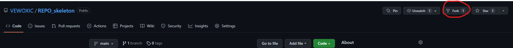
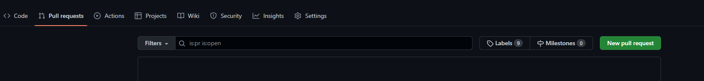

# Something about FORK and PULL REQUEST

## Basic workflow

 CURELAB                Your Account  
 ___________             __________  
|           |           |          |  
| v1.0      |   Fork    |  v1.0    |  
| Repo      | ------->  |  Repo    |  
|___________|           |__________|  
                            |  
                            | Edit on your computer and commit to your forked repo  
                            ↓  
 CURELAB                Your Account  
 ___________             __________  
|           |           |          |  
| v1.0      |           |  v1.1    |
| Repo      |           |  Repo    |
|___________|           |__________|
                  |
                  |  create pull request
                  ↓
 CURELAB                Your Account
 ___________             __________
|           |   Pull    |          |
| v1.0      |  Request  |  v1.1    |
| Repo      |<----------|  Repo    |
|___________|           |__________|
      |
      |  pass our Verify and test, MERGE!
      ↓
 CURELAB                Your Account
 ___________             __________
|           |           |          |
| v1.1      |           |  v1.1    |
| Repo      |           |  Repo    |
|___________|           |__________|

## Buttons you will need

1. create a fork  
2. clone your forked repo to your local computer and edit
3. when ready to submit, select pull request page in your forked repo and click new pull request button 
4. check the source and destination (should be VEWOXIC/xxx_REPO-main <- YOURACCOUNT/xxx_repo-yourbranch) and create pull request. 
5. We will check your code and merge if no conflict. 